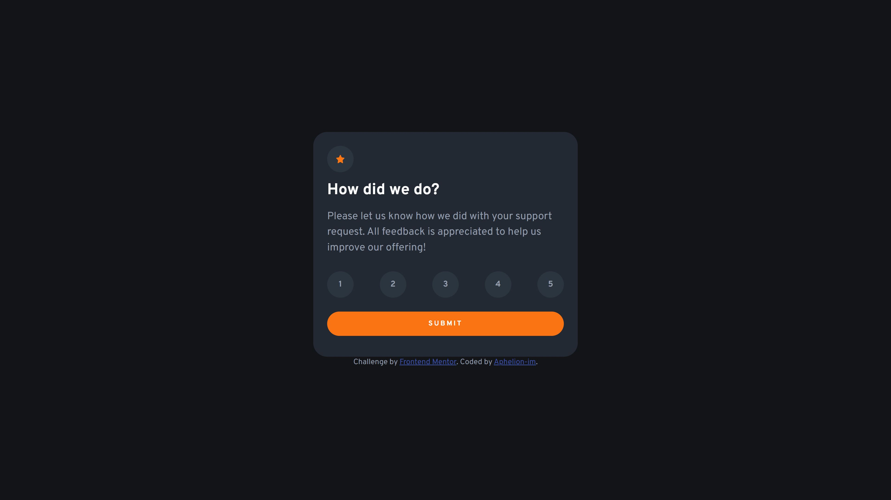

# Frontend Mentor - Interactive rating component solution

This is a solution to the [Interactive rating component challenge on Frontend Mentor](https://www.frontendmentor.io/challenges/interactive-rating-component-koxpeBUmI). Frontend Mentor challenges help you improve your coding skills by building realistic projects. 

## Table of contents

- [Overview](#overview)
  - [The challenge](#the-challenge)
  - [Screenshot](#screenshot)
  - [Links](#links)
- [My process](#my-process)
  - [Built with](#built-with)
  - [What I learned](#what-i-learned)
  - [Continued development](#continued-development)
  - [Useful resources](#useful-resources)

## Overview

### The challenge

Users should be able to:

- View the optimal layout for the app depending on their device's screen size
- See hover states for all interactive elements on the page
- Select and submit a number rating
- See the "Thank you" card state after submitting a rating

### Screenshot

### Links

- Solution URL: [Github repo](https://github.com/Aphelion-im/Interactive-rating-component)
- Live Site URL: [Add live site URL here](https://your-live-site-url.com)

## My process

### Built with

- Semantic HTML5 markup
- Sass
- Flexbox
- Mobile-first workflow
- ViteJS

### What I learned
- e.target.getAttribute("data-value"); Instead of e.target.value; Where a value attribute was on a list item, which is not allowed on this element.
- That border-radius: 9999px; gives you a pill shaped button.

### Continued development
- I will probably convert this project to React at some point.

### Useful resources

- [HTML & CSS validator](https://validator.w3.org/nu/#textarea) - To validate my HTML and CSS

## Author

- Frontend Mentor - [@Aphelion-im](https://www.frontendmentor.io/profile/Aphelion-im)

